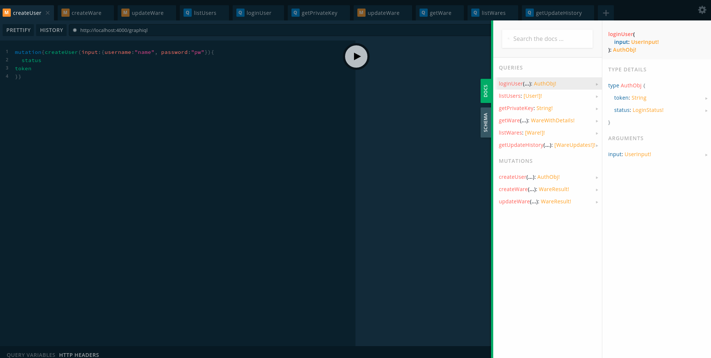

# Hyperledger Sawtooth Reason Logistics
<p align="center">
</p>
<br/>

This project was created during the course of a Bachelor's Thesis at the Vienna University of Technology. 
The goal is to provide a proof of concept of a blockchain application using ReasonML in combination with Hyperledger Sawtooth
while exploring the capabilities this relatively new framework provides. 

Since Sawtooth is such a novel technology, there aren't many (public) projects that are currently making use of it, which makes 
it interesting to utilize and observe it's benefits. In fact, the only non-trivial resources that were available at the time
of developing this project was Sawtooth's own [reference tutorial project for developing a supply chain](https://github.com/hyperledger/education-sawtooth-simple-supply), which was often made use of as a reference guide.

In it's end state, this project will provide the following features:

- Frontend client which sends requests to API
- API which processes client requests and wraps them into a transaction
- Processor which processes transaction requests and saves data onto the blockchain
- Subscriber which obtains saved data on blockchain and stores them in a "reporting database"
	to provide faster queries for the API

## Quickstart
### Cross-plattform Instructions
To run the application you must have installed [docker](https://docs.docker.com/install/#server) and [docker-compose](https://docs.docker.com/compose/install/).

### Installing and Running Hyperledger Sawtooth Reason Logistics
```
git clone https://github.com/techniqs/hyperledger-sawtooth-reason-logistics.git

cd hyperledger-sawtooth-reason-logistics/

docker-compose up
````
The application is ready as soon as the hsrl-client reports that it started on port 3000. 

### Running tests
```
git clone https://github.com/techniqs/hyperledger-sawtooth-reason-logistics.git

cd hyperledger-sawtooth-reason-logistics/tests

docker-compose -f tests.yaml up

````

## Application Internals

### Client

<p align="center">
</p>

The above image shows the frontend/client-side of the application, which runs on localhost:3000, where you can easily create transactions which then get forwarded to the custom graphql API.

Possible transactions are: 
-	Create a new user
-	Create a new ware
-	Update attributes of existing ware like (name, uvp)
-	Update location of existing ware like (longitude, latitude)
-	Transfer ware to a new owner

### Custom graphql API

<p align="center">
</p>

The above image shows the graphql-api playground of the application, which runs on localhost:4000/graphiql, where you can create transactions through mutations which get sent to the sawtooth validator and access the database with the given queries.

The API itself doesn't store data in the reporting database except in the Auth table to instantly return a JWT token for the client.

Also the playground provides documentation about every query and mutation the API has to offer.

### Processor

After the transaction is validated by the sawtooth validator, the processor receives the transaction requests and stores data depending on the action of the transaction and on the addresses which the processor can read from/write to.

#### CreateUser Action
The processor receives a transaction with user relevant information as well as the action "create_user", which defines the function to be called. 
This data is stored if and only if the storage address, which is calculated off the user's signerPublicKey, matches the output address of the transaction request and there hasn't been anything stored under this storage address yet.  

#### SetWare Action
Since a ware's EAN-Code has the property of uniqueness, the address to store information about a ware is generated off it. 
The processor receives a transaction with ware relevant information as well as the action "set_ware". This action can output 3 different results:

* If there is no data stored under a specific address, then the ware's payload is stored under this address and its result is the creation of a new ware.

* If there already is some data saved under this address, but the transaction's input data specifies only 2 addresses (ware- and owner-address), the action will result in an update of the ware and the provided data is stored as additional information under a ware's storage address.

* If some data has already been stored under this address, and the input of the transaction consists of 3 addresses (ware-, oldowner-, newowner-address) the action will result in an update of the ware as well as in a transfer of ownership of a ware.

### Subscriber
After a payload gets saved on the blockchain, the sawtooth validator broadcasts an event with the data which gets caught by the subscriber.
The only functionality the subscriber has, is to create a new block for every event and save the broadcasted data in the reporting database. The usefulness of this action is that the custom graphql api doesn't have to access the blockchain for every query, and instead queries over the reporting database for way faster query responses.

## Some Thoughts

The main challenge I had to face at the start of implementation was the lack of knowledge in ReasonML. 
Binding specific JS functions/classes from the sawtooth-core was a necessity to write my ReasonML transaction processor.
I spent quite some time figuring out how to extend classes in ReasonML or rather figuring out that extending a class isn't a feature which ReasonML intends to ever implement. So I had to keep some JS files because ReasonML couldn't handle everything.

After having overcome these issues for the transaction processor, the rest of the work like creating a transaction and sending it to the validator was quite easy, thanks to the JS specific application developer docs. The only thing I wasn't able to find neither in the docs, nor in the comments of their JS sawtooth-core code were means to catch data which gets broadcasted by the sawtooth-validator after a successful save on the blockchain. To me it felt like the original authors slacked on the JS code compared to the python code in regard of documentation. Luckily the [simple-supply-repo](https://github.com/hyperledger/education-sawtooth-simple-supply) implemented a subscriber in python and I was able to guide my way through it.   

All in all I'm still glad I used ReasonML, even though I had to face some difficulties, because now I have made sure that the processor is at least type safe.

## Acknowledgment
Special thanks go out to [Tan](https://github.com/tanmaster), who helped me obtain a fundamental understanding of blockchains.

Thanks to the contributors of [education-sawtooth-simple-supply](https://github.com/hyperledger/education-sawtooth-simple-supply), which guided me into the right direction for developing an appliction on sawtooth.

## Useful Links
- [Sawtooth JS Application Developers Guide](https://sawtooth.hyperledger.org/docs/core/releases/1.0/app_developers_guide/javascript_sdk.html)
- [ReasonML docs](https://reasonml.github.io/docs/en/what-and-why)